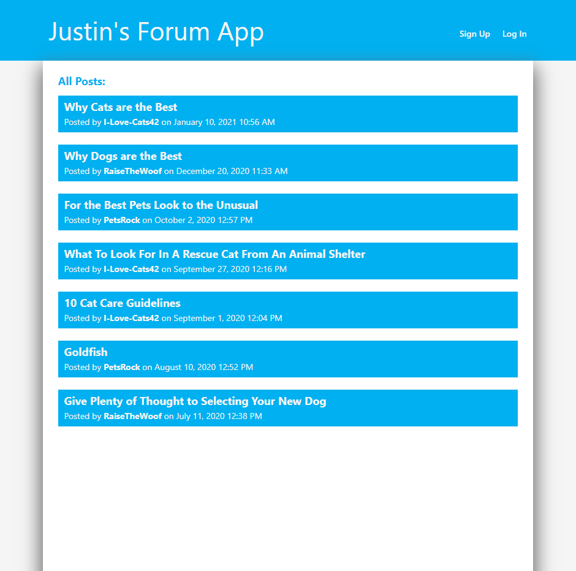
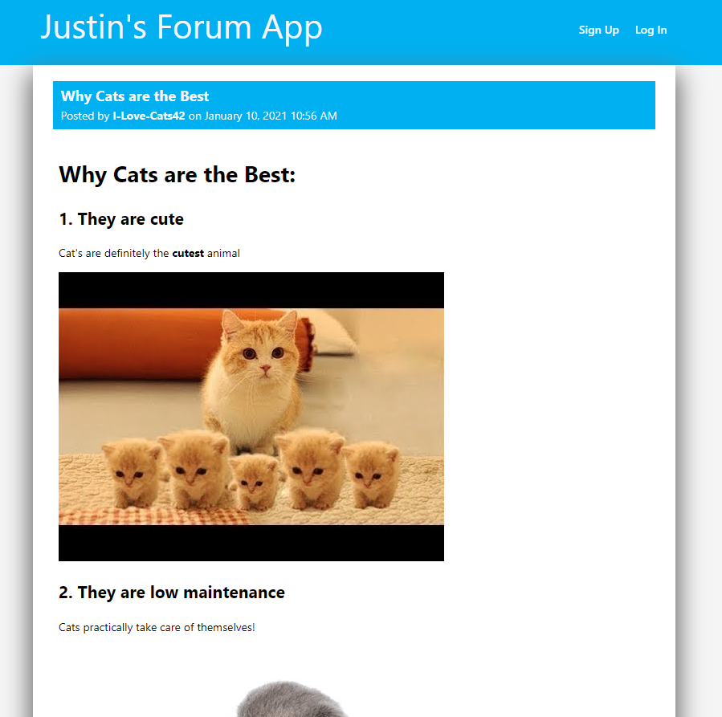
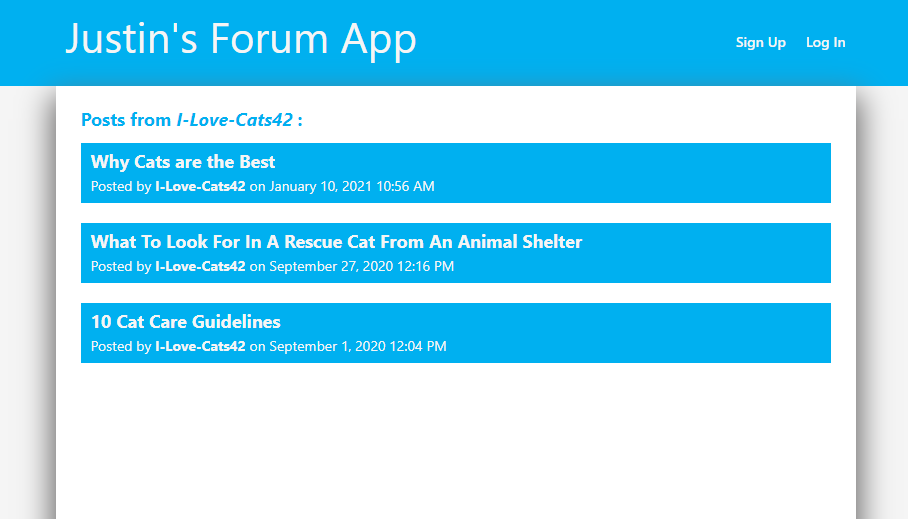
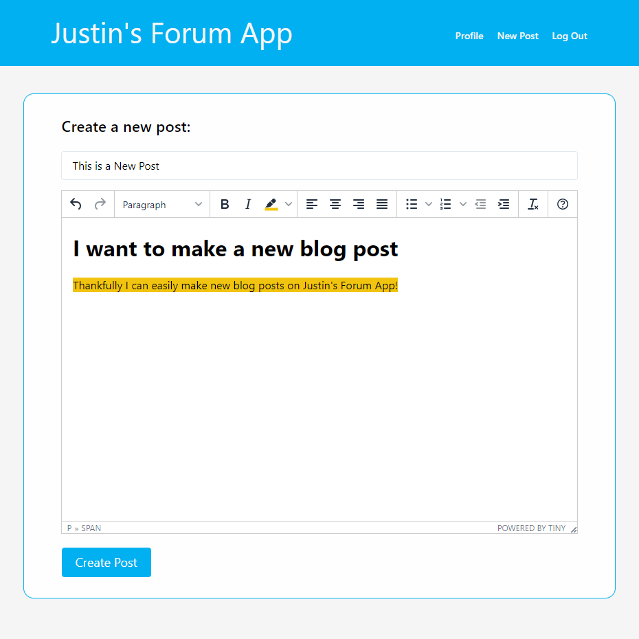
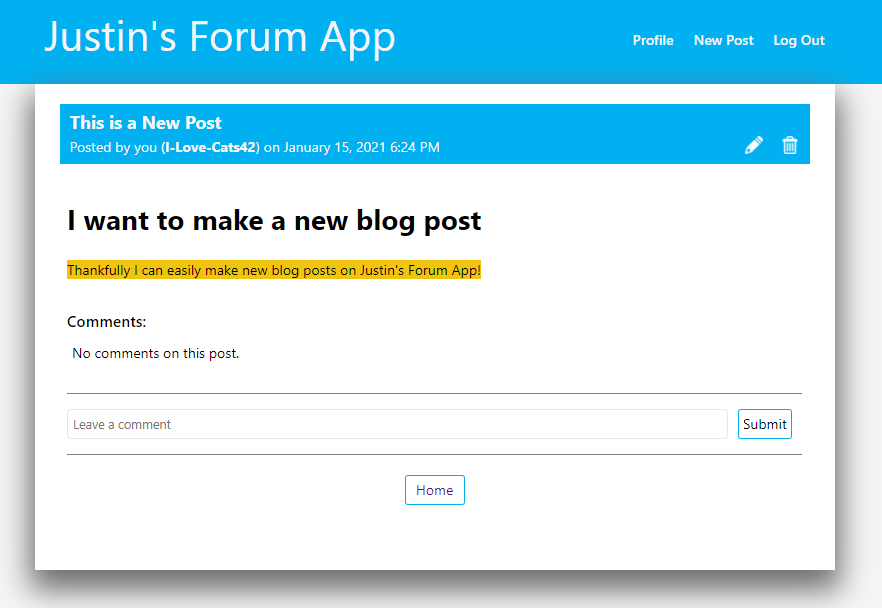
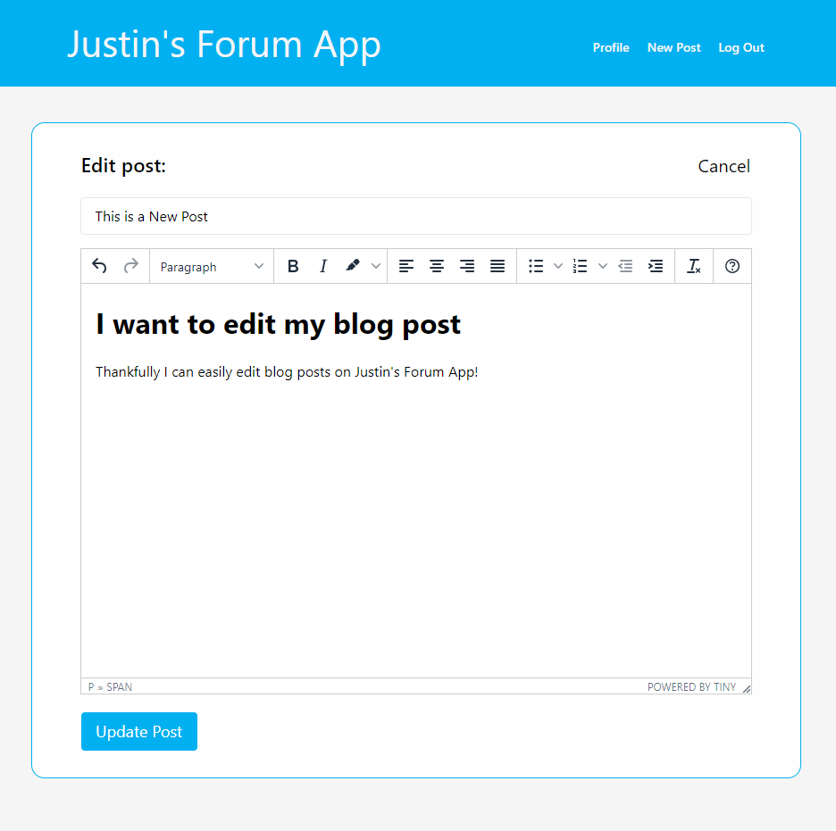
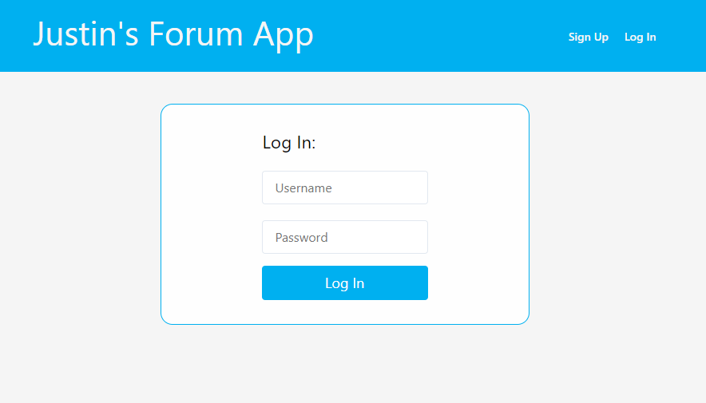
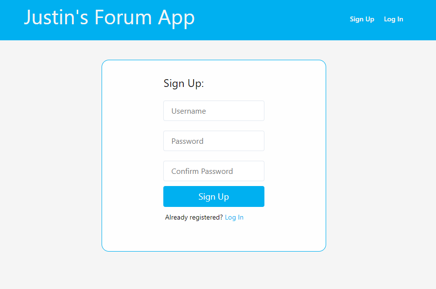

# Justin's Forum App
A RESTful online forum/blog application with CRUD operations.
  Users can post articles and pictures, comment on other's posts, and edit or delete their own posts.

Full stack MERN Application, deployed on Heroku.

🔗 **Live preview** of the app is [here](https://justins-forum.herokuapp.com/).

🔗 **API** can be accessed [here](https://justins-forum-api.herokuapp.com/).

## API Documentation
* Base URL: [https://justins-forum-api.herokuapp.com/](https://justins-forum-api.herokuapp.com/)

| Method        | Endpoint       | Usage |Parameters| 🔒 |
| ------------- |:-------------| :-----|----| ---|
| GET      | / | Get all posts | |  |
| GET      | /user | Get current user | | ✅ |
| POST      | /user/log-in      |   Log in in as user |username*, password*, confirm-password*|
| POST | /user/new      |    Sign up as a user |username*, password*|
| GET | /user/posts |Get all posts from current user | | ✅|
| GET | /user/:userid/posts |Get all posts from specific user | | |
| GET | /post | Get all posts | |
| POST | /post/new | Create new post |title*, content*| ✅|
| GET | /post/:postid | Get specific post |  | |
| PUT | /post/:postid | Edit a post |title*, content*| ✅|
| DELETE | /post/:postid | Delete a post |title*, content*| ✅|
| PUT | /post/:postid/publish | Publish a post |  | ✅|
| PUT | /post/:postid/unpublish | Unpublish a post |  | ✅|
| GET | /post/:postid/comments | Get all comments on a post | |
| POST | /post/:postid/comment | Comment on a post |text*| ✅|
| DELETE | /post/:postid/:commentid | Delete a comment |  | ✅|
| PUT | /post/:postid/:commentid/unpublish | Unpublish a comment |  | ✅|

*required (\*)*

## Features: ##

* RESTful API is versatile and accessible by any frontend.
* CRUD Operations: 
   * Create, read, edit, and delete posts
   * Create, read, and delete comments
   * Create, read, and edit your user profile
* TinyMCE Rich Text Editor 
  * Users can create posts with a variety of formatting 
  * Posts can contain pictures, and gifs
  * Allows ultimate flexibility and customization of posts
* User Authenticaiton:
  * Sign up as a new user
    * bcryptjs: Hashes passwords in order to safely secure user data
  * Log in in order to create posts and comments
    * jsonwebtoken - creates token for API to verify on each call, expires within an hour of inactivity
* Easy to edit or delete your own existing posts
* View specific user profiles
* View each post and interact by leaving a comment
* badWords: Filter won't allow posts with bad words in the title

# Built With: #

* ReactJS
* JavaScript
* NodeJS
* ExpressJS
* MongoDB + Mongoose
* Axios
* HTML/CSS
* Heroku Hosting

## Pictures: ##

#### Main Page: ####

#### Post Page: #### 

#### User specific page: #### 

#### Create new posts: #### 

#### Edit your posts: #### 

#### User Authentication: #### 

#### Sign up: #### 

